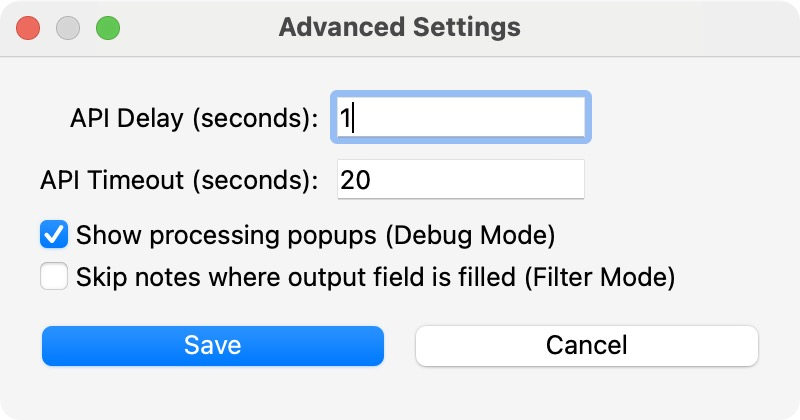
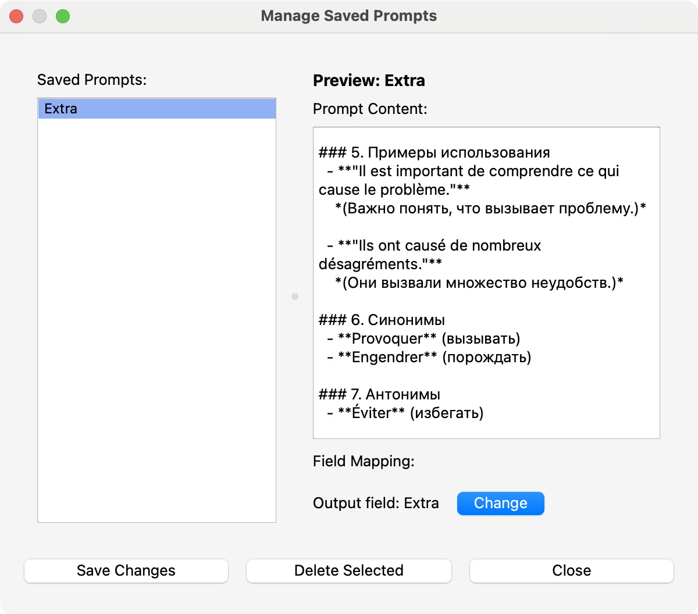
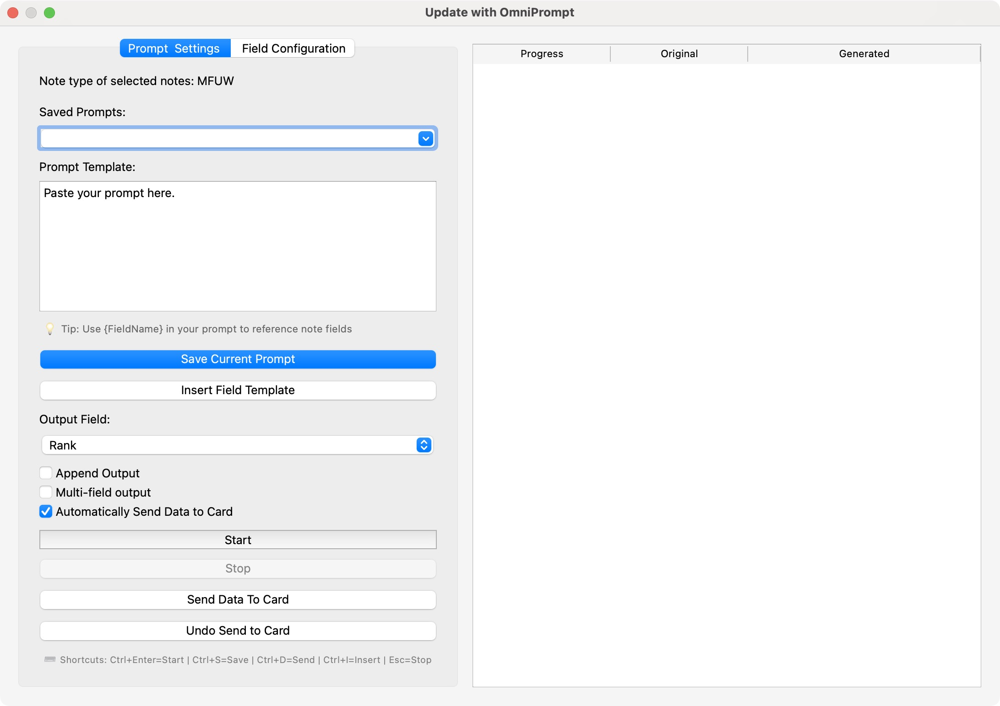

# OmniPrompt Anki User Guide

## Table of Contents
- [Installation](#installation)
  - [From AnkiWeb](#from-ankiweb)
  - [From Codeberg or GitHub](#from-codeberg-or-github)
- [Setup](#setup)
- [User Interface](#user-interface)
  - [Find Add-on Settings](#find-add-on-settings)
  - [Settings Menu](#settings-menu)
  - [Advanced Settings](#advanced-settings)
  - [Manage Saved Prompts](#manage-saved-prompts)
  - [Update with OmniPrompt](#update-with-omniprompt)
  - [Batch Processing Window](#batch-processing-window)
- [How It Works](#how-it-works)
- [Core Features](#core-features)
  - [Single-field Processing](#single-field-processing)
  - [Multi-field Output](#multi-field-output)
  - [Batch Processing](#batch-processing)
  - [Filter Mode](#filter-mode)
  - [Debug Mode](#debug-mode)
  - [Auto-send to Card](#auto-send-to-card)
- [AI Providers & Configuration](#ai-providers--configuration)
  - [OpenAI](#openai)
  - [DeepSeek](#deepseek)
  - [Google Gemini](#google-gemini)
  - [Anthropic (Claude)](#anthropic-claude)
  - [xAI (Grok)](#xai-grok)
  - [Ollama (Local)](#ollama-local)
  - [LM Studio (Local)](#lm-studio-local)
  - [GPT-5.4 Specific Settings](#gpt-54-specific-settings)
- [Prompt Templates & Management](#prompt-templates--management)
  - [Using Field Placeholders](#using-field-placeholders)
  - [Saving and Loading Prompts](#saving-and-loading-prompts)
  - [Multi-field Prompt Example](#multi-field-prompt-example)
- [Advanced Settings](#advanced-settings-1)
  - [API Delay](#api-delay)
  - [Timeout](#timeout)
  - [DeepSeek Streaming](#deepseek-streaming)
- [Keyboard Shortcuts](#keyboard-shortcuts-1)
- [Troubleshooting & Logging](#troubleshooting--logging)
- [Examples of Use](#examples-of-use)
  - [Language Translation](#language-translation)
  - [Word Definitions](#word-definitions)
  - [Synonyms & Vocabulary Expansion](#synonyms--vocabulary-expansion)
  - [Text Formatting & Cleanup](#text-formatting--cleanup)
  - [Example Sentence Generation](#example-sentence-generation)
  - [Grammar & Verb Conjugation](#grammar--verb-conjugation)
  - [Medical Term Explanation](#medical-term-explanation)
- [Customizing Prompts with Note Fields](#customizing-prompts-with-note-fields)
- [Frequently Asked Questions](#frequently-asked-questions)

---

## Installation

### From AnkiWeb
1. Open Anki and go to **Tools → Add-ons → Get Add-ons**.
2. Enter the add-on code:
   ```
   1383162606
   ```
3. Restart Anki to complete the installation.

### From Codeberg or GitHub
#### 1️⃣ Clone the Repository
```sh
# Codeberg
git clone https://codeberg.org/stanamosov/omniprompt-anki.git

# GitHub
git clone https://github.com/stanamosov/omniprompt-anki.git
```
#### 2️⃣ Install the Add-on
1. Navigate to your Anki add-ons directory:
   - **macOS/Linux**: `~/.local/share/Anki2/addons21/`
   - **Windows**: `%APPDATA%\Anki2\addons21\`
2. Copy the `omniprompt-anki` folder into the add-ons directory.
3. Restart Anki.

---

## Setup
1. Open Anki and go to **Tools → OmniPrompt-Anki → Settings**.
2. Select your AI provider and enter your **API key** (if required).
3. Choose the **AI model** appropriate for your provider.
4. Configure **Temperature** and **Max Tokens** as needed.
5. Click **Save** and start using the add-on!

---

## User Interface

### Find Add-on Settings
Open Anki and go to **Tools → OmniPrompt-Anki → Settings**.


### Settings Menu
Configure API Provider (OpenAI, Gemini, etc.), API Key, Model, Temperature, Max Tokens, and toggles like Debug Mode and Filter Mode.


### Advanced Settings
Click **Advanced Settings** in the configuration window to modify API Delay, Timeout, and DeepSeek streaming behavior.


### Manage Saved Prompts
View, edit, or delete saved prompt presets in a dedicated UI panel.


### Update with OmniPrompt
Right-click in the Anki Browser to update notes using AI.


### Batch Processing Window
Track generation progress and view original content alongside AI output during bulk updates.


---

## How It Works
1. **Select notes** in the Anki Browser.
2. **Right-click → Update with OmniPrompt**.
3. **Pick the output field** where AI-generated responses will be stored.
4. **Choose a prompt** from templates and customize it using placeholders from note fields.
5. **Click Start** – AI generates and saves content into the selected notes.
6. **Edit manually** if needed before finalizing, click "Send Data To Card" to save your edits.
7. **Enjoy enhanced flashcards!**

---

## Core Features

### Single-field Processing
The standard workflow where AI output is saved to a single field. You can choose to append to existing content or replace it.

### Multi-field Output
OmniPrompt can parse AI responses into multiple fields automatically. Enable "Auto-detect multiple output fields" in the Update with OmniPrompt dialog. When enabled, the add-on will detect structured output and map content to the appropriate note fields.

**How to Use Multi-field Mode:**
1. **Enable multi-field mode**: Check "Auto-detect multiple output fields" in the Update with OmniPrompt dialog
2. **Craft your prompt**: Include field placeholders (e.g., `{Front}`) and specify the desired output format
3. **Start processing**: The AI response will be automatically parsed into multiple fields
4. **Review and save**: Check the parsed fields in the table, make edits if needed, then save to notes

**Supported Output Formats:**
- **Code blocks**: ```FieldName\nContent``` (recommended for most AI models)
- **XML-like tags**: `<FieldName>Content</FieldName>`
- **JSON**: `{"Field1": "content", "Field2": "content"}` (enable JSON mode for structured providers)

**In-App Guidance:**
- **Tooltip**: Hover over the multi-field checkbox for detailed instructions
- **Pro tip**: Shows example prompt format for multi-field output
- **Test parse button**: Test parsing on a single note before processing the entire batch
- **Available fields**: Shows fields from your note model for reference

**Advanced Features:**
- **JSON mode**: For structured providers like OpenAI/Anthropic - provides more reliable parsing
- **Auto-append format instructions**: Automatically adds formatting guidance to your prompt
- **Field mismatch handling**: Detects when parsed fields don't match note fields and offers auto-mapping
- **Note type consistency check**: Warns when processing notes of different types
- **Append mode**: Append AI-generated content to existing field content with separator
- **Hide raw output**: Toggle to hide/show the raw AI output column for better focus

**Tips for Power Users:**
- Use `{Field}` placeholders in your prompt to reference note fields
- Include explicit format instructions in your prompt for best results
- Test small batches first with the "Test Parse on 1 Note" button
- Use JSON mode with structured providers like GPT-5.4 for maximum reliability
- The table will automatically expand to accommodate all detected fields
- For wide tables, use horizontal scrolling to view all fields

### Batch Processing
Process multiple notes simultaneously with real-time progress tracking. Each note's status is displayed in the progress table.

### Filter Mode
When enabled, OmniPrompt will skip notes where the output field is already filled. This prevents overwriting existing content.

### Debug Mode
When enabled, shows processing popups and detailed feedback. Disable for cleaner operation during batch processing.

### Auto-send to Card
When enabled, generated content is automatically saved to the card without requiring manual confirmation. Disable if you prefer to review and edit content before saving.

---

## AI Providers & Configuration

### OpenAI
- **API Key**: Required from [OpenAI Platform](https://platform.openai.com/api-keys)
- **Supported Models**: `gpt-4o-mini`, `gpt-3.5-turbo`, `gpt-4o`, `gpt-5.4`, `gpt-5.4-pro`, `gpt-5.4-mini`, `gpt-5.4-nano`, `gpt-5`, `o3-mini`, `o1-mini`, `gpt-4.1`, `gpt-4.1-mini`, `gpt-4.1-nano`
- **Custom Models**: Add any OpenAI-compatible model via the "+" button in settings

### DeepSeek
- **API Key**: Required from [DeepSeek Platform](https://platform.deepseek.com/api_keys)
- **Supported Models**: `deepseek-chat`, `deepseek-reasoner`
- **Streaming**: Optional real-time response streaming

### Google Gemini
- **API Key**: Required from [Google AI Studio](https://makersuite.google.com/app/apikey)
- **Supported Models**: `gemini-1.5-flash`, `gemini-1.5-pro`, `gemini-2.0-flash`, `gemini-2.0-flash-thinking`

### Anthropic (Claude)
- **API Key**: Required from [Anthropic Console](https://console.anthropic.com/)
- **Supported Models**: `claude-3-opus-20240229`, `claude-3-sonnet-20240229`, `claude-3-haiku-20240307`

### xAI (Grok)
- **API Key**: Required from [xAI Platform](https://console.x.ai/)
- **Supported Models**: `grok-3-latest`, `grok-3-mini-latest`

### Ollama (Local)
- **No API Key Required**
- **Base URL**: `http://localhost:11434` (default)
- **Supported Models**: Any Ollama model (`llama3.2`, `llama3.1`, `llama2`, `mistral`, `mixtral`, `codellama`, `phi`, `gemma`, `qwen2.5`, etc.)
- **Requirement**: Ollama must be running locally

### LM Studio (Local)
- **No API Key Required**
- **Base URL**: `http://localhost:1234` (default)
- **Supported Models**: Any model loaded in LM Studio
- **Requirement**: LM Studio must be running with server enabled

### GPT-5.4 Specific Settings
For GPT-5.4 models (`gpt-5.4`, `gpt-5.4-pro`, etc.), additional settings are available:
- **Reasoning Effort**: Controls how much "thinking" the model does before responding (`none`, `low`, `medium`, `high`, `xhigh`)
- **Verbosity**: Controls response detail level (`low`, `medium`, `high`)
- **Note**: GPT-5.4 models don't support temperature parameter

---

## Prompt Templates & Management

### Using Field Placeholders
Use **any field** from your note type in prompts. Field names are **case-sensitive**. You can use **multiple fields** in your prompt and even use your **Output field** for input - this makes it possible to change formatting of existing fields!

**Example Using Multiple Fields**:
```
Generate a detailed explanation for "{Japanese Word}". Include this example: "{Sentence}".
```

### Saving and Loading Prompts
1. Create or modify a prompt in the "Update with OmniPrompt" dialog
2. Click "Save Current Prompt" to store it with a name
3. Saved prompts appear in the dropdown for quick selection
4. Use **Tools → OmniPrompt → Manage Prompts** to edit or delete saved prompts

### Multi-field Prompt Example
Here's an example prompt for generating content into multiple fields:

```
"{Simplified} ({Pinyin})" can be used in different ways, give 2-4 example sentences.
Follow this formatting, output in code blocks:

```Sentences_Hanyu
句子1<br/>句子2...
```
```Sentences_Pinyin
Jùzǐ1<br/>Jùzǐ2...
```
```Sentences_English
literal translation1<br/>literal translation2...
```

Try to use words that are similar in HSK level. Try to output fewer sentences if the word is simple/self explanatory. Include one complex sentence or colloquial slang.

Do not explain or provide additional output. Don't number or label the sentences.
```

This prompt will generate Chinese example sentences with Pinyin and English translations, automatically parsed into three separate fields.

---

## Advanced Settings

Access these settings via **Tools → OmniPrompt → Settings → Advanced Settings**.

### API Delay
Adds a short pause between consecutive requests to avoid rate limits. Recommended: 1-2 seconds for most providers.

### Timeout
Adjusts how long the add-on waits for each API request to finish. Increase for slower connections or complex queries.

### DeepSeek Streaming
Enables partial message updates in real time for DeepSeek models. Provides visual feedback during generation.

---

## Keyboard Shortcuts

**Ctrl+Shift+O (Windows/Linux) / Cmd+Shift+O (macOS)** – Open the **Update with OmniPrompt** dialog in the browser.  
**Ctrl+Return** – Immediately start processing selected notes.

---

## Troubleshooting & Logging

OmniPrompt-Anki maintains a log file (**omniprompt_anki.log**) inside the add-ons folder to track API requests, responses, and potential errors. This helps with troubleshooting issues like API connection failures, timeouts, or unexpected responses. The log file is capped at **5MB**, with up to **two backups** to prevent excessive disk usage.

To access logs:
1. Open **Tools → OmniPrompt → Settings**
2. Click **View Log** to inspect recent activity

Common issues and solutions:

1. **API Connection Failed**
   - Check your internet connection
   - Verify API key is correct and has sufficient credits
   - Ensure the selected model is available for your account

2. **Local Models Not Working (Ollama/LM Studio)**
   - Verify Ollama/LM Studio is running
   - Check base URL matches your local setup
   - Confirm model name is correct

3. **No Response from AI**
   - Increase timeout in Advanced Settings
   - Check log file for error details
   - Try a simpler prompt to test connectivity

4. **Field Placeholders Not Working**
   - Ensure field names match exactly (case-sensitive)
   - Check that notes have values in the referenced fields

---

## Examples of Use

### Language Translation
**Prompt:**
```plaintext
Translate this French word "{French Word}" to English. Answer with translation only.
```

### Word Definitions
**Prompt:**
```plaintext
Explain this Polish word "{Polish Word}". Answer with definition only, do not add any other comments.
```

### Synonyms & Vocabulary Expansion
**Prompt:**
```plaintext
What are synonyms for this French word "{French Word}". Answer with a list of synonyms only.
```

### Text Formatting & Cleanup
**Prompt:**
```plaintext
Format this text "{Explanation}" in markdown. Answer with formatted text only, do not add any comments.
```

### Example Sentence Generation
**Prompt:**
```plaintext
Generate two example sentences for language learners at the B1-B2 level using the word "{Word}".
```

### Grammar & Verb Conjugation
**Prompt:**
```plaintext
What is the correct form of the French verb "{Verb}" in {Tense} for {Person}? Explain the conjugation rule.
```

### Medical Term Explanation
**Prompt:**
```plaintext
Explain the medical term "{Term}" in simple language. Include its symptoms, causes, and treatments.
```

---

## Customizing Prompts with Note Fields

You can reference any field from your note type using `{FieldName}` syntax. The add-on automatically replaces these placeholders with the actual field values before sending to the AI.

**Tips:**
- Field names are case-sensitive: `{Word}` ≠ `{word}`
- Use multiple fields in a single prompt
- You can reference the output field itself to reformat existing content
- For missing fields, the placeholder will remain unchanged (e.g., `{MissingField}`)

**Advanced Example:**
```
Create a comprehensive study note for "{Term}".

Include:
1. Definition: {Definition}
2. Examples: {Example1}, {Example2}
3. Related terms: {RelatedTerms}

Format the output as a markdown table comparing {Term} with {SimilarTerm}.
```

---

## Frequently Asked Questions

**Q: Can I use OmniPrompt without an internet connection?**
A: Yes, with local models (Ollama or LM Studio). You'll need to download models in advance.

**Q: How much does it cost to use?**
A: OmniPrompt itself is free. You pay only for API usage with cloud providers (OpenAI, Anthropic, etc.) according to their pricing. Local models are free.

**Q: Can I use multiple AI providers at once?**
A: You can switch between providers in settings, but only one provider is active at a time.

**Q: Is my data sent to AI providers?**
A: Yes, when using cloud providers. For local models (Ollama/LM Studio), data stays on your computer.

**Q: How do I update to the latest version?**
A: Via AnkiWeb (automatic updates) or manually update from Codeberg/GitHub.

**Q: Can I contribute new features or report bugs?**
A: Yes! See the [Contributing section](https://github.com/stanamosov/omniprompt-anki#-contributing) in the main README.

---

*Need more help? Open an issue on [Codeberg](https://codeberg.org/stanamosov/omniprompt-anki) or [GitHub](https://github.com/stanamosov/omniprompt-anki).*